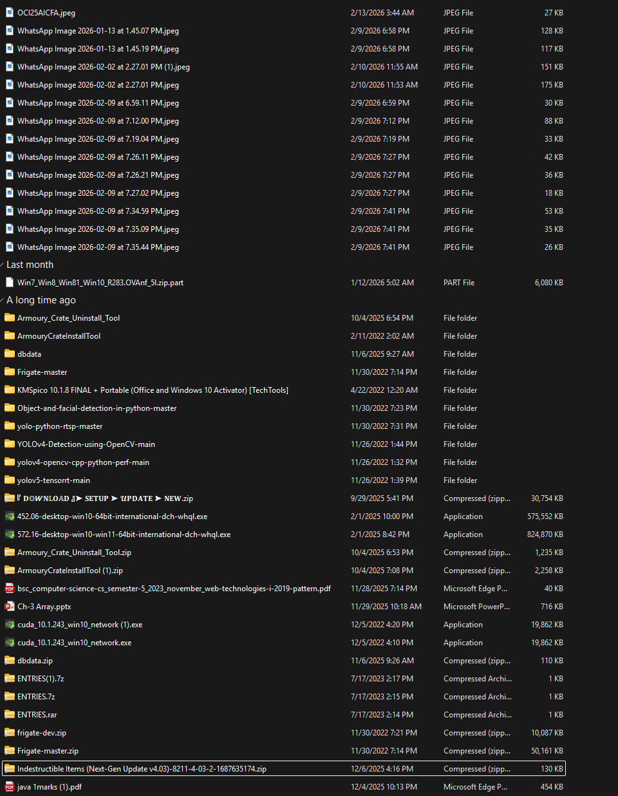
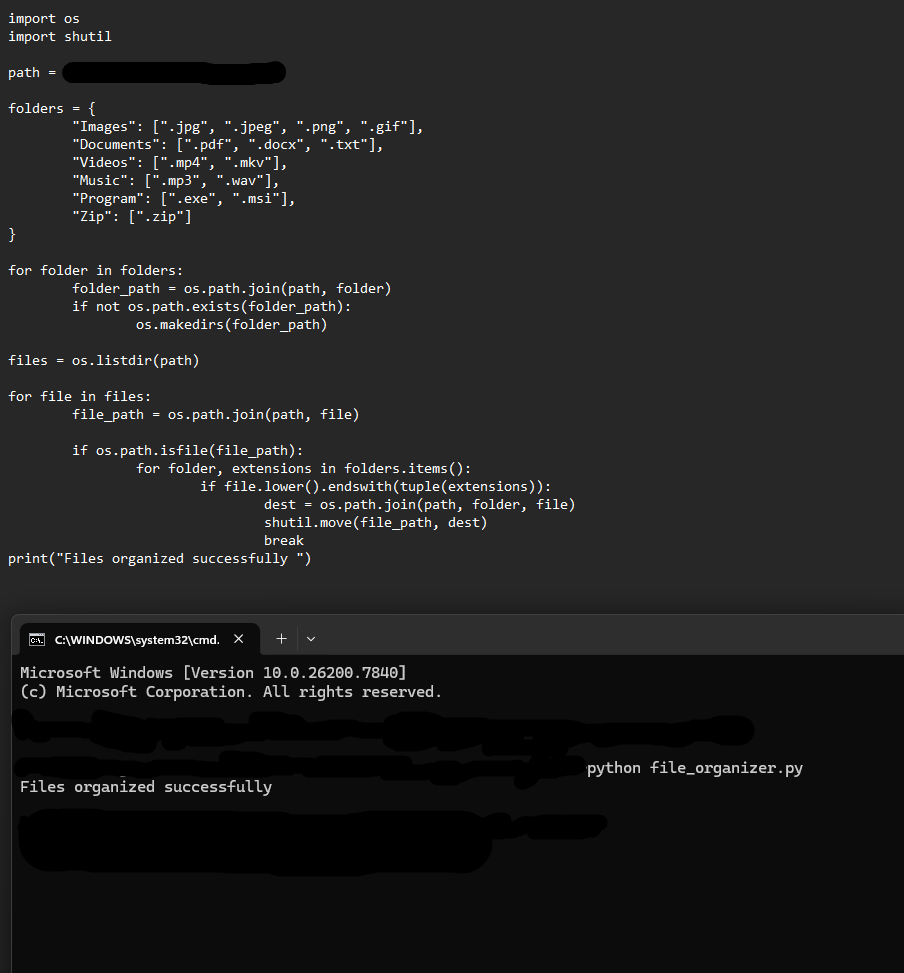
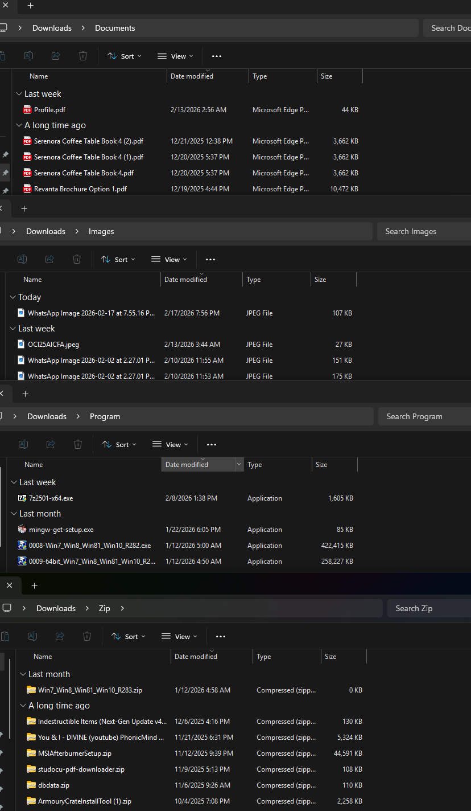

# 📂 File Organizer (Python)

This project is a Python automation script that organizes files into categorized folders based on file type.

## Author
- DHANAY KELKAR
  
## Features
- Automatically creates folders
- Sorts images, documents, videos, music, and programs
- Uses file handling and OS automation

## Technologies Used
- Python
- os module
- shutil module

## Screenshots

### Before Code


### Code & Output


### After Code


### After Folders

## How to Run

```bash
python file_organizer.py

